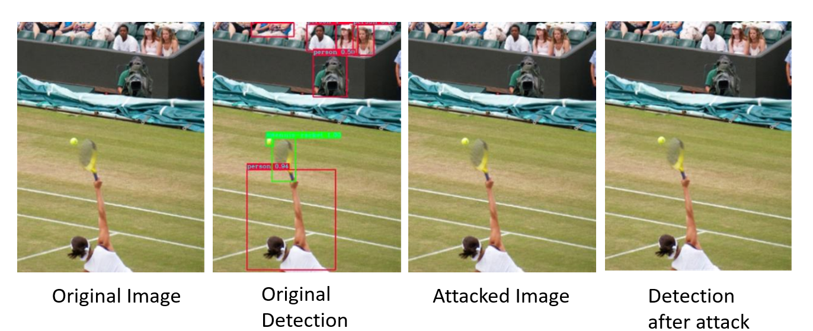
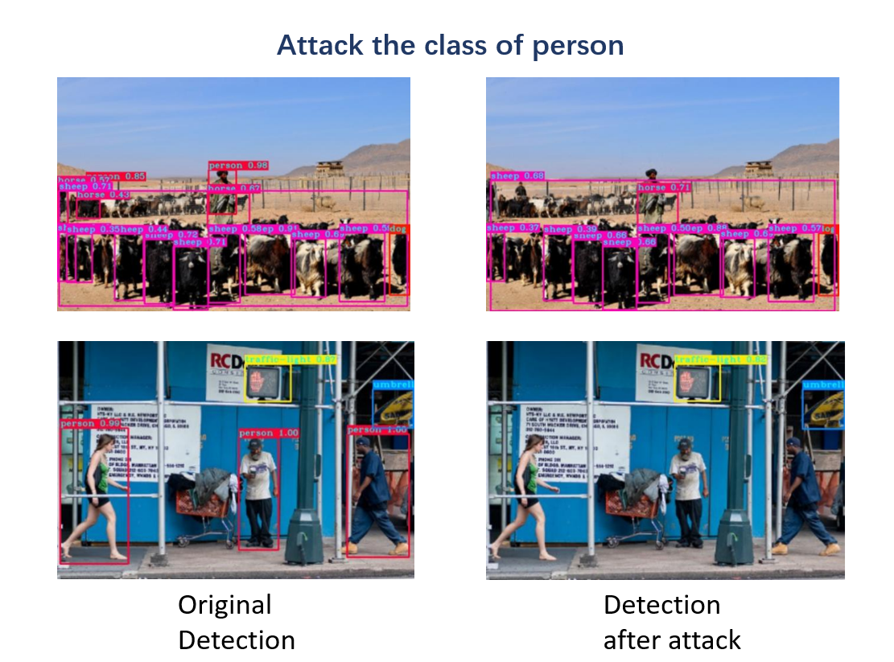
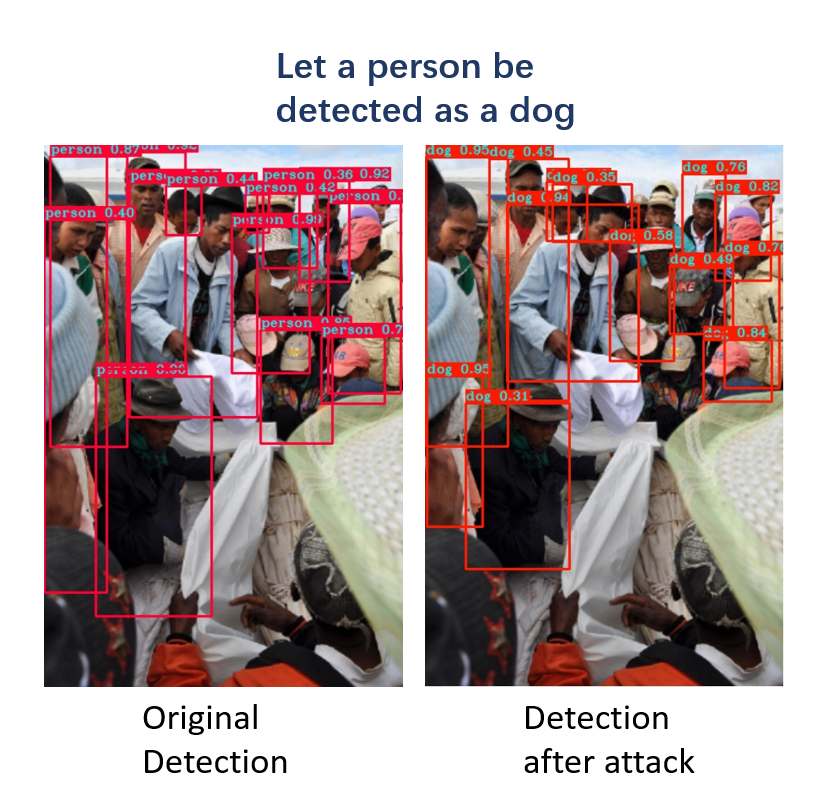
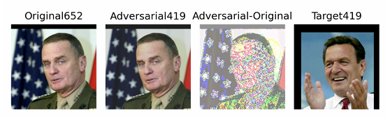
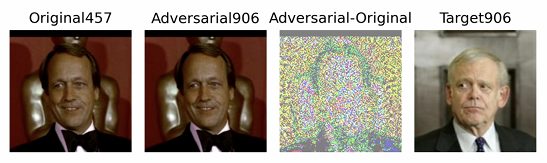

# Adversarial attack on classical object recognition and detection network   

## Introduction
Adversarial attack can generate attack samples for the classical object detection and recognition network. An adversarial attack in machine learning refers to a technique used to fool machine learning models. This is typically done by making subtle, calculated modifications to the input data, causing the model to make a mistake in its output or decision. It can evaluate the robustness of models, reveal vulnerabilities of systems, enhance privacy protection and act as a form of regularization to enhance generalization. 

## Demo
### Object detection
#### Untargeted attack
Make all of the bounding box disappear.



#### Targeted attack
Make the targeted bounding boxs disappear.



#### Targeted attack with a goal
Make the targeted bounding boxs identify the object to another specific class.



### Object recognition

#### CWattack

The number over the images is the representation of one person. In the above picture, the first image is the original image and the number following 'original' means the person is 
No.652. The second image is the attacked image which is almost the same as the first image and it is recognized wrongly as another person whose number is 419. And the image of No.419 person is displayed at the last image and we can find there is no similarity between them. 

#### Deepfool

The layout of the picture is the same.


## Algorithm Explanation
### Object detection


In order to reduce the *loss* function from falling into the local optimum during the training process. We first gradient processed the *loss* function.This gradient processing can make *loss* more inclined to optimize pixels with high gradient values. After designing the *loss* function. We use the *loss* function to derive the derivative of the entire image to obtain the gradient image. Then we made *𝑀ASK*, *𝑀ASK* which are used to select which points to use for attack.

Then enter the random-hot restart part of our design. We set the upper limit of the maximum change points to 2% of the original image, and the update amplitude is smaller than the visible range of the human eye (within 15 grayscale values). Then specify the upper limit of pixel value for each iteration 𝑛𝑢𝑚.

The single random-hot restart process is as follows:

Sort all the gradient values in the gradient graph, and then randomly select 𝑛𝑢𝑚 values from the top N values that we set to satisfy the upper limit of the gradient value greater than the threshold for this round of updates. Then update *MASK* immediately and reduce the upper limit N, and perform a single round of iteration upper limit based on the gradient image after *𝑀𝐴𝑆𝐾* masking, that is, control each update to be carried out with a smaller amplitude, and then add the single round gradient update to the cumulative gradient update pool. And control the cumulative gradient update value to be less than the upper limit of variation. Finally, subtract the cumulative gradient from the original image, and control the pixel range of the adversarial image to be within (0-255) to obtain the adversarial image.

Then the operation is restarted immediately, and we save the smallest adversarial image of 𝑙𝑜𝑠𝑠. Until the restart reaches the upper limit or the attack is successful.

Here is the pseudocode:
```
Input: Original_image
Output: Adversarial_image
for 𝑖 = 1 → 𝑙𝑒𝑛(𝑂𝑟𝑖𝑔𝑖𝑛𝑎𝑙_𝑖𝑚𝑎𝑔𝑒) do
  𝑝𝑒𝑟𝑠𝑖𝑠𝑡_𝑛𝑢𝑚 ← 0
  𝑎𝑡𝑡𝑎𝑐𝑘_𝑝𝑖𝑥𝑒𝑙_𝑛𝑢𝑚 ← 0
  ˜𝑥 ←𝑂𝑟𝑖𝑔𝑖𝑛𝑎𝑙_𝑖𝑚𝑎𝑔𝑒[𝑖]
  𝑥 ←𝑂𝑟𝑖𝑔𝑖𝑛𝑎𝑙_𝑖𝑚𝑎𝑔𝑒[𝑖]
  for 𝑗 = 1 → 𝑒𝑝𝑜𝑐ℎ do
    if 𝑎𝑡𝑡𝑎𝑐𝑘_𝑝𝑖𝑥𝑒𝑙_𝑛𝑢𝑚 < 0.02 × 𝑝𝑖𝑥𝑒𝑙_𝑛𝑢𝑚 then
      𝑚𝑎𝑠𝑘 ←𝑔𝑒𝑡_𝑚𝑎𝑠𝑘(˜𝑥,𝑎𝑡𝑡𝑎𝑐𝑘_𝑝𝑖𝑥𝑒𝑙_𝑛𝑢𝑚)
      𝑎𝑡𝑡𝑎𝑐𝑘_𝑝𝑖𝑥𝑒𝑙_𝑛𝑢𝑚 ← 𝑎𝑡𝑡𝑎𝑐𝑘_𝑝𝑖𝑥𝑒𝑙_𝑛𝑢𝑚 +𝑖𝑛𝑐𝑟𝑒𝑚𝑒𝑛𝑡
    end if
    ˆ𝑦 ←𝑌𝑜𝑙𝑜𝑣3(˜𝑥)
    𝐿𝑜𝑠𝑠 ← 𝐿(˜𝑥, ˆ𝑦)
    if 𝐿𝑜𝑠𝑠 > 𝑡ℎ𝑟𝑒𝑠ℎ𝑜𝑙𝑑 and 𝑝𝑒𝑟𝑠𝑖𝑠𝑡_𝑛𝑢𝑚 > 0 then
      𝑝𝑒𝑟𝑠𝑖𝑠𝑡_𝑛𝑢𝑚 ← −1
    end if
    if 𝐿𝑜𝑠𝑠 ≥ 𝑡ℎ𝑟𝑒𝑠ℎ𝑜𝑙𝑑 then
      𝑟𝑒𝑛𝑒𝑤_𝑔𝑟𝑎𝑑𝑒 ← 𝑚𝑎𝑠𝑘 ×𝑔𝑟𝑎𝑑𝑒.𝑐𝑙𝑎𝑚𝑝_(−0.005,0.005)
      𝑐𝑢𝑚𝑢𝑙𝑎𝑡𝑖𝑣𝑒_𝑔𝑟𝑎𝑑𝑒 ← 𝑐𝑢𝑚𝑢𝑙𝑎𝑡𝑖𝑣𝑒_𝑔𝑟𝑎𝑑𝑒 +𝑟𝑒𝑛𝑒𝑤_𝑔𝑟𝑎𝑑𝑒
      𝑐𝑢𝑚𝑢𝑙𝑎𝑡𝑖𝑣𝑒_𝑔𝑟𝑎𝑑𝑒.𝑐𝑙𝑎𝑚𝑝_(−0.06,0.06)
      ˜𝑥 ←𝑥−𝑐𝑢𝑚𝑢𝑙𝑎𝑡𝑖𝑣𝑒_𝑔𝑟𝑎𝑑𝑒
      ˜𝑥.𝑑𝑎𝑡𝑎.𝑐𝑙𝑎𝑚𝑝_(0,1)
    else
      𝑝𝑒𝑟𝑠𝑖𝑠𝑡_𝑛𝑢𝑚 ← 𝑝𝑒𝑟𝑠𝑖𝑠𝑡_𝑛𝑢𝑚 + 1
      if 𝑝𝑒𝑟𝑠𝑖𝑠𝑡_𝑛𝑢𝑚 > 4 then
        Break
      end if
    end if
  end for
  𝐴𝑑𝑣𝑒𝑟𝑠𝑎𝑟𝑖𝑎𝑙_𝑖𝑚𝑎𝑔𝑒[𝑖] ← ˜𝑥
end for
```

### Object recognition
Based on the specific meanings of c and k, we propose a CWattack in which c and k can be changed.

When the sample is first generated, there is a large gap between the generated image and the original image. At this time, 𝑅𝑛 should be used as the main loss function, that is, an image similar to the original image must be generated first. At this time, we set c to 0.

When the adversarial sample is similar to the original sample, that is, when 𝑅𝑛 is less than a certain value, c and k are set to a certain value. At this time, the loss function 𝐾𝑛 starts to take effect, and the probability of the adversarial sample being misidentified increases.

If you want the confidence that the adversarial sample will be misidentified to be high, CWattack can stop here. If you want the adversarial sample to achieve the adversarial effect with as small changes as possible, you can also enter the next stage. At this time, adjust both c and k smaller than in the previous stage, and then train.


## Instruction
### Object detection
Open random_make_patch.py, set the parameters you need in the parameter list, and start running.

* **Model loading**: First, the required model will be loaded from the pretrained_models_pytorch/pretrainedmodels folder. If it is target recognition, the model parameters of the corresponding network will be downloaded through the Internet. If it is target detection, the model will be loaded in yolo.py in the folder. and return.

* **Sample loading**: After the model is loaded, the Dataloader will load all images and labels from the corresponding folder where the training data is stored.

* **Training process**: Use the loaded images and models in random_make_patch.py to train adversarial samples. The finally generated adversarial samples, original images, original prediction images, and post-attack prediction images are stored in the advspec folder at the same level. The results generated by the attack will be saved to predict_results_without_attack.json.

* **Evaluate**: Use the coco toolbox to compare the saved json and the original new.json and generate the pr curve and store it in prcurve at the same level.
### Object recognition

* **Model loading**: Open the test_deepfool.py or test_CWattack file, and read the original sample and target sample in the images. Then input them into the network to obtain the category of the original sample and the category of the target sample. Use the category of the target sample as the target of targeted confrontation.
  
* **Training process**: Use deepfool and CWattack perturb the sample, and the output result includes a picture composed of the perturbation.

* **Evaluate**: After perturbation, the picture, the number of iterations, the original category, the target category, the category of the interfered image, and put the interfered image into the corresponding out file.
