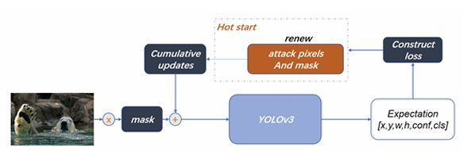

# Adversarial attack on classical object recognition and detection network   

## Introduction
Adversarial attack can generate attack samples for the classical object detection and recognition network. An adversarial attack in machine learning refers to a technique used to fool machine learning models. This is typically done by making subtle, calculated modifications to the input data, causing the model to make a mistake in its output or decision. It can evaluate the robustness of models, reveal vulnerabilities of systems, enhance privacy protection and act as a form of regularization to enhance generalization. 

## Demo
### Object detection

### Object recognition


## Algorithm Explanation
### Object detection


In order to reduce the *loss* function from falling into the local optimum during the training process. We first gradient processed the *loss* function, as follows:


Here is the pseudocode:
```
Input: Original_image
Output: Adversarial_image
for 𝑖 = 1 → 𝑙𝑒𝑛(𝑂𝑟𝑖𝑔𝑖𝑛𝑎𝑙_𝑖𝑚𝑎𝑔𝑒) do
  𝑝𝑒𝑟𝑠𝑖𝑠𝑡_𝑛𝑢𝑚 ← 0
  𝑎𝑡𝑡𝑎𝑐𝑘_𝑝𝑖𝑥𝑒𝑙_𝑛𝑢𝑚 ← 0
  ˜𝑥 ←𝑂𝑟𝑖𝑔𝑖𝑛𝑎𝑙_𝑖𝑚𝑎𝑔𝑒[𝑖]
  𝑥 ←𝑂𝑟𝑖𝑔𝑖𝑛𝑎𝑙_𝑖𝑚𝑎𝑔𝑒[𝑖]
  for 𝑗 = 1 → 𝑒𝑝𝑜𝑐ℎ do
    if 𝑎𝑡𝑡𝑎𝑐𝑘_𝑝𝑖𝑥𝑒𝑙_𝑛𝑢𝑚 < 0.02 × 𝑝𝑖𝑥𝑒𝑙_𝑛𝑢𝑚 then
      𝑚𝑎𝑠𝑘 ←𝑔𝑒𝑡_𝑚𝑎𝑠𝑘(˜𝑥,𝑎𝑡𝑡𝑎𝑐𝑘_𝑝𝑖𝑥𝑒𝑙_𝑛𝑢𝑚)
      𝑎𝑡𝑡𝑎𝑐𝑘_𝑝𝑖𝑥𝑒𝑙_𝑛𝑢𝑚 ← 𝑎𝑡𝑡𝑎𝑐𝑘_𝑝𝑖𝑥𝑒𝑙_𝑛𝑢𝑚 +𝑖𝑛𝑐𝑟𝑒𝑚𝑒𝑛𝑡
    end if
    ˆ𝑦 ←𝑌𝑜𝑙𝑜𝑣3(˜𝑥)
    𝐿𝑜𝑠𝑠 ← 𝐿(˜𝑥, ˆ𝑦)
    if 𝐿𝑜𝑠𝑠 > 𝑡ℎ𝑟𝑒𝑠ℎ𝑜𝑙𝑑 and 𝑝𝑒𝑟𝑠𝑖𝑠𝑡_𝑛𝑢𝑚 > 0 then
      𝑝𝑒𝑟𝑠𝑖𝑠𝑡_𝑛𝑢𝑚 ← −1
    end if
    if 𝐿𝑜𝑠𝑠 ≥ 𝑡ℎ𝑟𝑒𝑠ℎ𝑜𝑙𝑑 then
      𝑟𝑒𝑛𝑒𝑤_𝑔𝑟𝑎𝑑𝑒 ← 𝑚𝑎𝑠𝑘 ×𝑔𝑟𝑎𝑑𝑒.𝑐𝑙𝑎𝑚𝑝_(−0.005,0.005)
      𝑐𝑢𝑚𝑢𝑙𝑎𝑡𝑖𝑣𝑒_𝑔𝑟𝑎𝑑𝑒 ← 𝑐𝑢𝑚𝑢𝑙𝑎𝑡𝑖𝑣𝑒_𝑔𝑟𝑎𝑑𝑒 +𝑟𝑒𝑛𝑒𝑤_𝑔𝑟𝑎𝑑𝑒
      𝑐𝑢𝑚𝑢𝑙𝑎𝑡𝑖𝑣𝑒_𝑔𝑟𝑎𝑑𝑒.𝑐𝑙𝑎𝑚𝑝_(−0.06,0.06)
      ˜𝑥 ←𝑥−𝑐𝑢𝑚𝑢𝑙𝑎𝑡𝑖𝑣𝑒_𝑔𝑟𝑎𝑑𝑒
      ˜𝑥.𝑑𝑎𝑡𝑎.𝑐𝑙𝑎𝑚𝑝_(0,1)
    else
      𝑝𝑒𝑟𝑠𝑖𝑠𝑡_𝑛𝑢𝑚 ← 𝑝𝑒𝑟𝑠𝑖𝑠𝑡_𝑛𝑢𝑚 + 1
      if 𝑝𝑒𝑟𝑠𝑖𝑠𝑡_𝑛𝑢𝑚 > 4 then
        Break
      end if
    end if
  end for
  𝐴𝑑𝑣𝑒𝑟𝑠𝑎𝑟𝑖𝑎𝑙_𝑖𝑚𝑎𝑔𝑒[𝑖] ← ˜𝑥
end for
```

### Object recognition

## Instruction
### Object detection
Open random_make_patch.py, set the parameters you need in the parameter list, and start running.

* **Model loading**: First, the required model will be loaded from the pretrained_models_pytorch/pretrainedmodels folder. If it is target recognition, the model parameters of the corresponding network will be downloaded through the Internet. If it is target detection, the model will be loaded in yolo.py in the folder. and return.

* **Sample loading**: After the model is loaded, the Dataloader will load all images and labels from the corresponding folder where the training data is stored.

* **Training process**: Use the loaded images and models in random_make_patch.py to train adversarial samples. The finally generated adversarial samples, original images, original prediction images, and post-attack prediction images are stored in the advspec folder at the same level. The results generated by the attack will be saved to predict_results_without_attack.json.

* **Evaluate**: Use the coco toolbox to compare the saved json and the original new.json and generate the pr curve and store it in prcurve at the same level.
### Object recognition

* **Model loading**: Open the test_deepfool.py or test_CWattack file, read the original sample and target sample in the images, and input them into the network to obtain the category of the original sample and the category of the target sample. Use the category of the target sample as the target of targeted confrontation.
  
* **Training process**: Use deepfool and CWattack perturb the sample, and the output result includes a picture composed of the perturbation.

* **Evaluate**: After perturbation, the picture, the number of iterations, the original category, the target category, the category of the interfered image, and put the interfered image into the corresponding out file.
